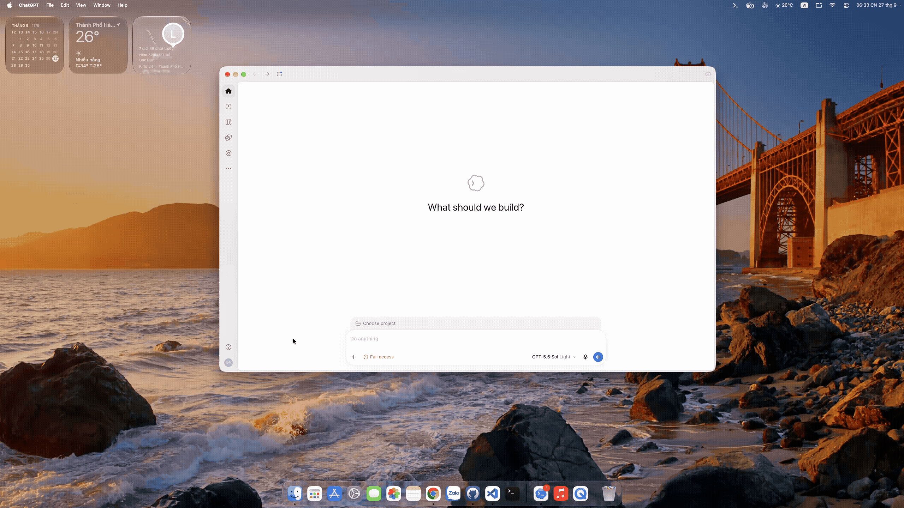

# LLM Account Switcher

A small macOS menu bar app for managing and switching accounts across AI coding CLIs.



[Tiếng Việt](#tiếng-việt) · [English](#english)

> [!IMPORTANT]
> LLM Account Switcher is an unofficial community project. It is not affiliated with or endorsed by OpenAI, Anthropic, Cursor, Google, or GitHub.

## Tiếng Việt

LLM Account Switcher giúp quản lý và chuyển tài khoản AI coding ngay trên menu bar macOS.

Hỗ trợ:

- ChatGPT Codex
- Claude Code
- Cursor Agent CLI
- Antigravity CLI
- GitHub Copilot CLI

### Tính năng

- Thêm, import và chuyển nhiều tài khoản cho từng CLI.
- Tự tìm binary; vẫn có thể chọn lại đường dẫn thủ công.
- Bật, tắt và kéo thả để sắp xếp các dịch vụ.
- Xác minh tài khoản sau khi chuyển và tự hoàn tác nếu thất bại.
- Hiển thị hạn mức, credit và thời gian reset của Codex.
- Thông báo khi hạn mức Codex 5 giờ hoặc tuần được reset.
- Chạy local, không có analytics hoặc telemetry.

### Yêu cầu

- macOS 14 trở lên.
- Swift 6.2 trở lên và Xcode tương ứng nếu chạy từ source.
- CLI của dịch vụ muốn sử dụng đã được cài trên máy.

### Chạy từ source

```bash
git clone https://github.com/vuduchiieu/llm-account-manager.git
cd llm-account-switcher
./build.sh
open .build/llm-account-switcher.app
```

### Cách dùng

1. Lần đầu mở app, chọn một dịch vụ, kiểm tra đường dẫn CLI rồi đăng nhập.
2. Nhấn trái icon trên menu bar để xem và chuyển tài khoản.
3. Nhấn phải icon để thêm tài khoản, mở Cài đặt hoặc thoát.
4. Vào **Cài đặt → Tài khoản** để thêm dịch vụ khác, sắp xếp và quản lý profile.

> [!WARNING]
> Hãy lưu công việc đang chạy trước khi chuyển tài khoản. Một số CLI hoặc ứng dụng liên quan cần được mở lại để nhận tài khoản mới.

### Dữ liệu và quyền riêng tư

Dữ liệu của ứng dụng nằm tại:

```text
~/Library/Application Support/llm-account-switcher/
```

- Profile Codex, Claude và Cursor được lưu local trên máy Mac.
- Phiên Antigravity được giữ trong macOS Keychain.
- Copilot dùng danh sách tài khoản do Copilot CLI quản lý; app chỉ lưu login, host và trạng thái đang dùng.
- Ứng dụng không có server riêng và không gửi dữ liệu phân tích.

## English

LLM Account Switcher manages and switches AI coding accounts from the macOS menu bar.

Supported providers:

- ChatGPT Codex
- Claude Code
- Cursor Agent CLI
- Antigravity CLI
- GitHub Copilot CLI

### Features

- Add, import, and switch multiple accounts for each CLI.
- Automatically detect binaries, with manual path selection when needed.
- Enable, disable, and reorder providers.
- Verify the selected account and roll back a failed switch.
- Show Codex usage limits, credits, and reset times.
- Notify when a Codex 5-hour or weekly limit resets.
- Run locally with no analytics or telemetry.

### Requirements

- macOS 14 or later.
- Swift 6.2 or later with a compatible Xcode version when running from source.
- The CLI for each provider you want to use installed on your Mac.

### Run from source

```bash
git clone https://github.com/vuduchiieu/llm-account-manager.git
cd llm-account-switcher
./build.sh
open .build/llm-account-switcher.app
```

### Usage

1. On first launch, choose one provider, confirm its CLI path, and sign in.
2. Left-click the menu bar icon to view and switch accounts.
3. Right-click it to add an account, open Settings, or quit.
4. Open **Settings → Accounts** to add providers, reorder them, and manage profiles.

> [!WARNING]
> Save active work before switching accounts. Some CLIs or related apps may need to be reopened before they use the new account.

### Data and privacy

App data is stored in:

```text
~/Library/Application Support/llm-account-switcher/
```

- Codex, Claude, and Cursor profiles are stored locally on your Mac.
- Antigravity sessions remain in macOS Keychain.
- Copilot uses the account list managed by Copilot CLI; the app stores only the login, host, and active state.
- The app has no project-owned server, analytics, or telemetry.
