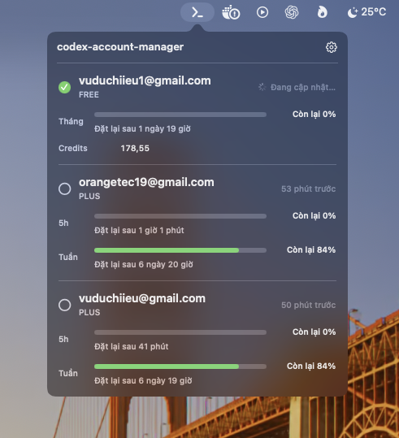
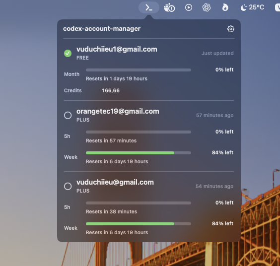

# codex-account-manager

Manage multiple ChatGPT Codex accounts directly from the macOS menu bar.

<p align="center">
  
  
</p>

[Tiếng Việt](#tiếng-việt) · [English](#english)

> [!IMPORTANT]
> codex-account-manager is an unofficial community project and is not affiliated with or endorsed by OpenAI.

## Tiếng Việt

codex-account-manager là ứng dụng macOS native, chạy local và không xuất hiện trong Dock. App giúp chuyển tài khoản Codex, theo dõi hạn mức và nhận thông báo khi hạn mức được đặt lại.

### Tính năng

- Thêm nhiều tài khoản qua luồng đăng nhập ChatGPT chính thức.
- Import tài khoản Codex đang dùng trên máy.
- Chuyển tài khoản bằng một lần nhấn; tự khởi động lại app ChatGPT/Codex đang chạy để credential mới có hiệu lực.
- Hiển thị email, gói tài khoản, hạn mức và thời gian reset của Free, Plus, Pro và các gói được Codex trả về.
- Tự cập nhật sau khi phát hiện hoạt động Codex, không polling mỗi 5 giây.
- Gửi thông báo macOS khi hạn mức **5h** hoặc **Tuần** được đặt lại.
- Tự theo giao diện sáng/tối và ngôn ngữ macOS: Việt, Anh, Nhật, Trung giản thể.
- Hỗ trợ mở cùng macOS và được bật mặc định.

### Yêu cầu

- macOS 14 trở lên.
- Swift 6.2 trở lên và Xcode tương ứng.
- Codex CLI đang hoạt động, hoặc Codex CLI đi kèm app ChatGPT.
- Tài khoản Codex dùng ChatGPT; không hỗ trợ tài khoản chỉ dùng API key.

### Cài đặt và chạy

```bash
git clone https://github.com/vuduchiieu/codex-account-manager.git
cd codex-account-manager
./build.sh
open .build/codex-account-manager.app
```

### Cách dùng

1. Nhấn chuột phải icon codex-account-manager để **Thêm tài khoản** hoặc **Import tài khoản Codex hiện tại**.
2. Nhấn chuột trái icon để xem tài khoản và hạn mức.
3. Nhấn vòng tròn cạnh email để chuyển tài khoản.
4. Nhấn thùng rác để xoá profile local. Thao tác này **không xoá tài khoản ChatGPT thật**.
5. Menu chuột phải cũng có tùy chọn mở cùng macOS và thoát app.

> [!WARNING]
> Chuyển tài khoản có thể khởi động lại app ChatGPT/Codex. Hãy lưu công việc đang làm trước khi chuyển.

### Dữ liệu và quyền riêng tư

codex-account-manager không có server riêng, analytics hoặc telemetry. Dữ liệu nằm tại:

```text
~/Library/Application Support/codex-account-manager/
```

- `accounts.json`: email, loại gói và hạn mức đã cache; không chứa token.
- `profiles/<UUID>/auth.json`: credential của từng profile local.
- `backups/pre-codex-account-manager-auth.json`: bản sao credential ban đầu nếu có.

App cập nhật `~/.codex/auth.json` theo kiểu atomic, xác minh email sau khi chuyển và rollback nếu thất bại. Hãy cấp quyền thông báo khi macOS hỏi để nhận cảnh báo reset hạn mức.

### Giới hạn

- Dữ liệu hạn mức phụ thuộc vào Codex CLI và phản hồi từ server.
- Chưa tự chuyển tài khoản khi hết hạn mức.
- Chưa có cloud sync, Developer ID signing hoặc notarization.

---

## English

codex-account-manager is a native, local-first macOS menu bar app for switching Codex accounts, checking usage limits, and receiving reset notifications. It does not appear in the Dock.

### Features

- Add multiple accounts through the official ChatGPT sign-in flow.
- Import the Codex account currently used on the Mac.
- Switch accounts with one click; automatically relaunch a running ChatGPT/Codex app so new credentials take effect.
- Show email, plan, usage windows, and reset times for Free, Plus, Pro, and other plans returned by Codex.
- Refresh after detected Codex activity without polling every five seconds.
- Send native macOS notifications when the **5-hour** or **weekly** limit resets.
- Follow macOS light/dark appearance and language: English, Vietnamese, Japanese, and Simplified Chinese.
- Open at login, enabled by default.

### Requirements

- macOS 14 or later.
- Swift 6.2 or later with a compatible Xcode version.
- A working Codex CLI, or the CLI bundled with the ChatGPT app.
- A ChatGPT-backed Codex account; API-key-only accounts are not supported.

### Install and run

```bash
git clone https://github.com/vuduchiieu/codex-account-manager.git
cd codex-account-manager
./build.sh
open .build/codex-account-manager.app
```

### Usage

1. Right-click the codex-account-manager icon to **Add Account** or **Import Current Codex Account**.
2. Left-click the icon to view accounts and usage.
3. Click the circle beside an email address to switch accounts.
4. Click the trash button to remove a local profile. This **does not delete the real ChatGPT account**.
5. The right-click menu also controls Open at Login and quitting the app.

> [!WARNING]
> Switching accounts may relaunch the ChatGPT/Codex app. Save active work before switching.

### Data and privacy

codex-account-manager has no project-owned server, analytics, or telemetry. Local data is stored in:

```text
~/Library/Application Support/codex-account-manager/
```

- `accounts.json`: cached email, plan, and usage metadata; no tokens.
- `profiles/<UUID>/auth.json`: credentials for each local profile.
- `backups/pre-codex-account-manager-auth.json`: the original credential backup when available.

codex-account-manager updates `~/.codex/auth.json` atomically, verifies the email after switching, and rolls back on failure. Allow notifications when prompted by macOS to receive quota-reset alerts.

### Limitations

- Usage data depends on the installed Codex CLI and server response.
- Accounts are not rotated automatically when a limit is reached.
- Cloud sync, Developer ID signing, and notarization are not included yet.
